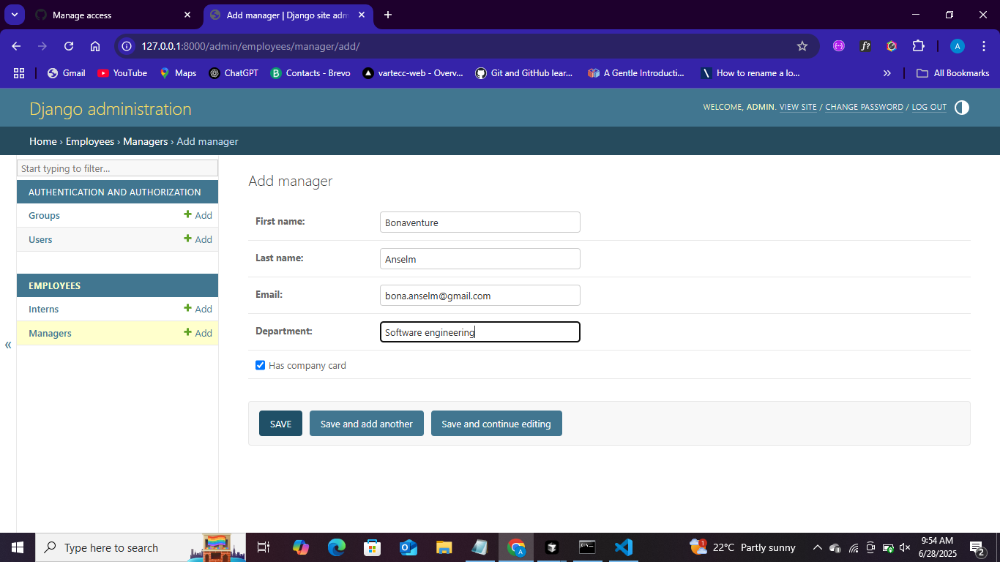
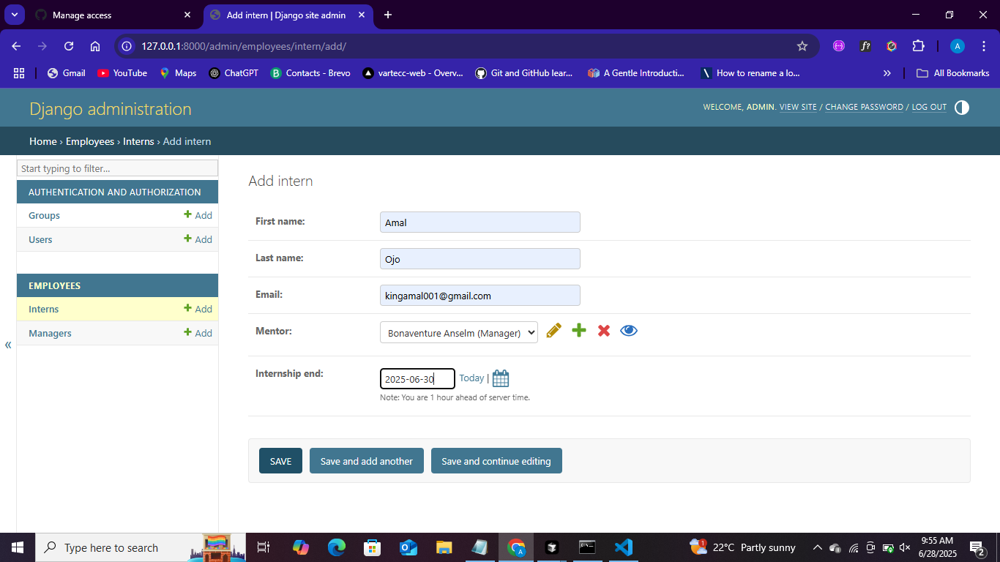

# SEN202_EXAM_9081

-------------------|------------------|
|**Amal Ojo**	|[githug_amallcodes](https://github.com/amallcodes/) |VUG/SEN/23/9081 

## Project Description

This project is a **Staff API Project for my (VUG/SEN/23/9081) SEN202 exam** built with Django and Django REST Framework. It provides a RESTful interface for managing staff records, allowing users to create, read, update, and delete staff information through HTTP endpoints.

## Images

